# Kevs Place

## Description: Code Institute Student Project Portfolio 4: Full-Stack Toolkit  

A restaurant website capable of reserving a table, canceling a reservations and viewing your resrvations.
 
It showcases my ability to use the Python Django Framework.

A live program can be found [here](https://kevinspp4.herokuapp.com/).

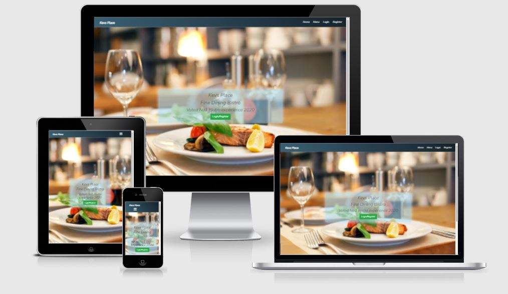

# Table of Contents
- [1. Introduction](#introduction)
- [2. How to use](#How-to-use)
- [3. Data Model and Technologies](#Data-Model-and-Technologies)
- [4. Testing](#testing)
- [5. Bugs](#bugs)
- [6. Future Updates](#future-updates)
- [7. Contribution Links](#contribution-links)
- [8. Deployment](#deployment)

# 1. Introduction
[Go to the top](#table-of-contents)

This is my first web application using the Django Framework. It is part of my project portfolio required in the Full-Stack Software Development Diploma I am currently undertaking. Django is a Python-based free and open-source web framework that follows the model–template–views architectural pattern.
 
The aim of the project is to create a restaurant reservations website.
The website should allow the user to book one or more guests into the restaurant at a time and date of the users choice.
The site owner will have a ability to take online bookings for their restaurant.
 

The main features consist of:
1. The ability to register on the website to access the reservations page.
2. The ability to login to the website once registered to view/make or cancel the users booking.
3. The ability to logout from the website once the user has viewed/made or canceled their booking.
4. The ability to view the menu page, opening times and where the restaurant is located.

## Purpose

Running a restaurant is a huge task that comes with a never-ending to-do-list. Most operators probably don’t like the idea of adding another assignment but there is one that is very important – a website. According to a [Constant Contact/Single Platform survey](https://localu.org/restaurants-local-search-data/), “75% of consumers surveyed often choose a restaurant to dine at based on search results”.
 
If a restaurant doesn’t have a website, they’re missing out on a massive audience. Online visibility is huge for restaurants and can ultimately determine whether customers come to at that restaurant or not. Some reasons to have a website for a restaurant are:

- Brand Image
- Convenience
- Improves Trust and Loyalty
- Keep Guests Informed
- Promote Other Services

# 2. How to use
[Go to the top](#table-of-contents)

When the user first opens the web application they will be able to view:

1. The landing page
2. The menu page
3. The login page
4. The register page

The user will need to create an account to view:

1. The reservations page
2. The booking page

## Walk Through

The following walkthrough with images shows the web application functionality:

### Unregistered Users

#### Landing Page

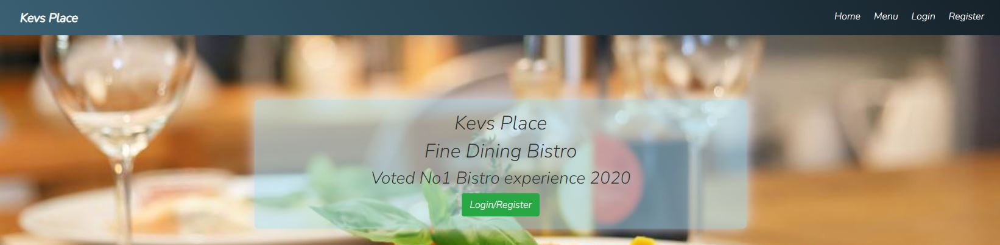
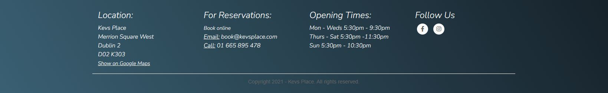

When the user first opens the web application they are greeted with a landing image and and the navbar.
 
The landing image indicates to the user that they will need to Login/Register to make a reservation.
 
The navbar allows the user to visit our menu page and also provides direction the both the login and register pages.
 
The footer informs the user of:

1. The location of the restaurant (As this is a college project, the restaurant location is made up. the [Show on Google Maps](https://www.google.ie/maps/place/Dublin,+D02+K303/@53.3414179,-6.2543296,17z/data=!4m5!3m4!1s0x48670e90ae6b6a7d:0x83dec26aaf2acc2b!8m2!3d53.3408889!4d-6.2524652) link is actaully the location of the National Gallery of Ireland).
2. Contact Details.
3. Opening Hours.
4. Links to Social media pages (As this is a college project, the social media links [Facebook](https://www.facebook.com/) [Instagram](https://www.instagram.com/) direct the user to the social media sign up pages).

#### Register

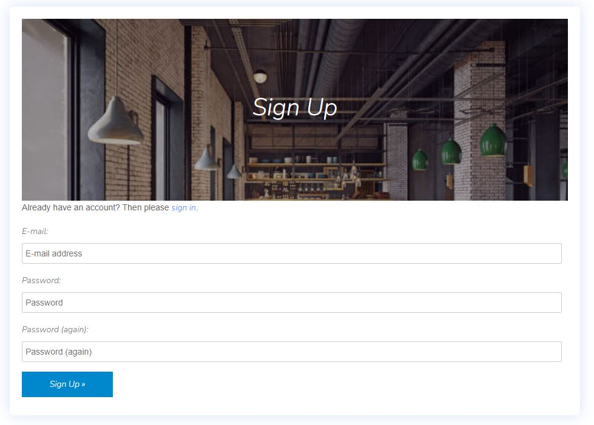

The register page is a form that requests the following details:

1. E-mail address
2. Password
3. Password confirmation

Onces the user provides these details, they can then access the web application and view/make or cancel a reservation.
 
If a user accesses the register page that is already registered there a link to the sign in page.

#### Login

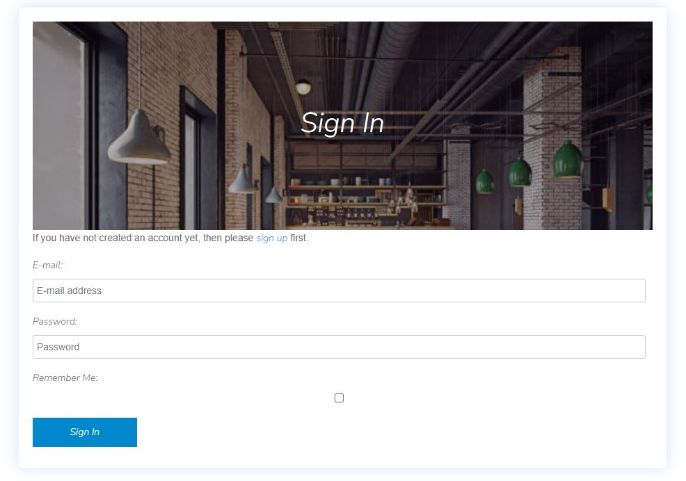

The login page is a form that requests the following details:

1. E-mail address
2. Password

Onces the user provides these details, they can then access the web application and view/make or cancel a reservation.
 
If the user accesses the login page that has not already registered there is a link to the register page.

#### Menu

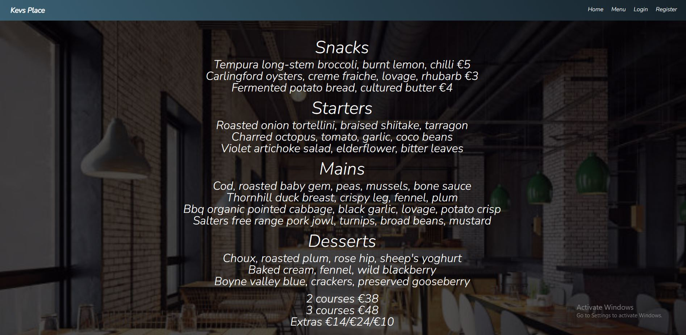

The menu page contains the menu available at the restaurant.

### Registered Users

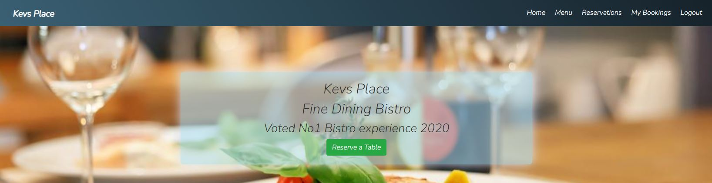

#### Landing Page

When the user registers they are greeted with a similar landing image and and the navbar with a few additional changes.
 
The landing image indicates to the user that they can reserve a table if they wish
 
The navbar allows the user to visit our menu page and also the reservation page and view mybooking page
 
The footer is unchanged from the unregistered view

#### Reservations

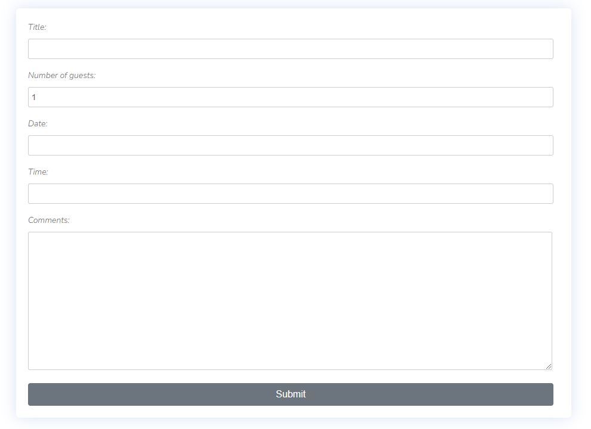

The Reservations page is a form that requests the following details:

1. Title
2. Number of Guests
3. Date
4. Time
5. Comments

Onces the user provides these details, they can reserve a table on a particalar date at a perticalar time.
 
Once the user submits the form they will be redirected to the my bookings page.

#### My Bookings

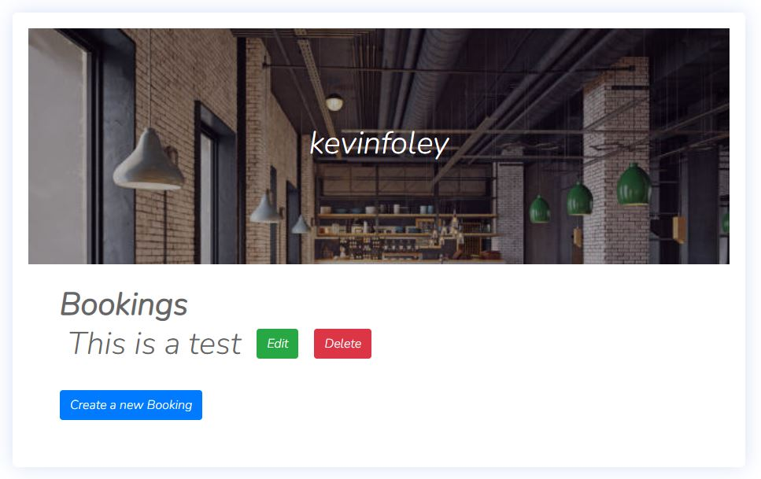

The My Bookings page shows the users bookings.
 
If there are no bookings made it will say "No Reservations made"
 
If there is a booking the user has the ability to edit or delete an existing booking and create a new booking if they wish.

##### Edit

The edit function on the My Booking page when clicked allows the user to edit there existing bookings on the reservations page.

##### Delete

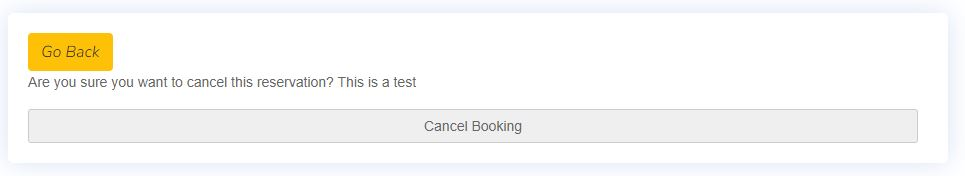

The delete function on the My Booking page allows the user to cancel their booking, once clicked the user will be asked "Are you sure you want to cancel this reservation" The title of the booking is also provided.
 
Their is also a "Go Back" link if the user changes their mind or clicked delete by mistake which brings the user back to the My Bookings page.

##### Create a new Booking

The create a new booking function allows the user to create a new booking by directing the the user to the reservations page once clicked on.

#### Logout

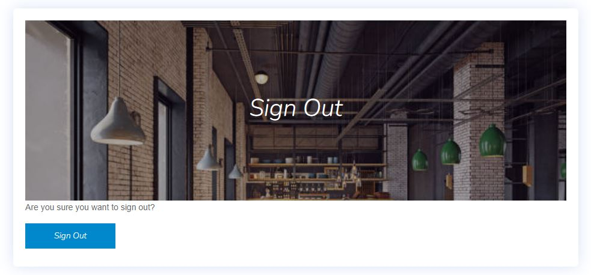

The logout page allows the user to logout. 

# 3. Data Model and Technologies
[Go to the top](#table-of-contents)

