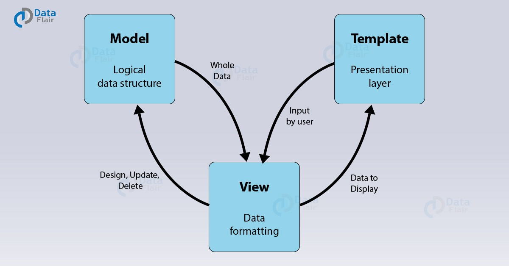

# Kevs Place

## Description: Code Institute Student Project Portfolio 4: Full-Stack Toolkit  

A restaurant website capable of reserving a table, canceling a reservations and viewing your resrvations.
 
It showcases my ability to use the Python Django Framework.

The deployed web application can be found [here](https://kevinspp4.herokuapp.com/).

# Table of Contents
- [1. Introduction](#introduction)
- [2. How to use](#How-to-use)
- [3. Frameworks and Technologies](#Frameworks-and-Technologies)
- [4. Testing](#testing)
- [5. Bugs](#bugs)
- [6. Future Updates](#future-updates)
- [7. Contribution Links](#contribution-links)
- [8. Deployment](#deployment)

# 1. Introduction
[Go to the top](#table-of-contents)

This is my first web application using the Django Framework. It is part of my project portfolio required in the Full-Stack Software Development Diploma I am currently undertaking. Django is a Python-based free and open-source web framework that follows the model–template–views architectural pattern.
 
The aim of the project is to create a restaurant reservations website.
The website should allow the user to book one or more guests into the restaurant at a time and date of the users choice.
The site owner will have a ability to take online bookings for their restaurant.
 

The main features consist of:
1. The ability to register on the website to access the reservations page.
2. The ability to login to the website once registered to view/make or cancel the users booking.
3. The ability to logout from the website once the user has viewed/made or canceled their booking.
4. The ability to view the menu page, opening times and where the restaurant is located.

## Purpose

Running a restaurant is a huge task that comes with a never-ending to-do-list. Most operators probably don’t like the idea of adding another assignment but there is one that is very important – a website. According to a [Constant Contact/Single Platform survey](https://localu.org/restaurants-local-search-data/), “75% of consumers surveyed often choose a restaurant to dine at based on search results”.
 
If a restaurant doesn’t have a website, they’re missing out on a massive audience. Online visibility is huge for restaurants and can ultimately determine whether customers come to at that restaurant or not. Some reasons to have a website for a restaurant are:

- Brand Image
- Convenience
- Improves Trust and Loyalty
- Keep Guests Informed
- Promote Other Services

# 2. How to use
[Go to the top](#table-of-contents)

When the user first opens the web application they will be able to view:

1. The landing page
2. The menu page
3. The login page
4. The register page

The user will need to create an account to view:

1. The reservations page
2. The booking page

## Walk Through

The following walkthrough with images shows the web application functionality:

### Unregistered Users

#### Landing Page

When the user first opens the web application they are greeted with a landing image and and the navbar.
 
The landing image indicates to the user that they will need to Login/Register to make a reservation.
 
The navbar allows the user to visit our menu page and also provides direction the both the login and register pages.
 
The footer informs the user of:

1. The location of the restaurant (As this is a college project, the restaurant location is made up. the [Show on Google Maps](https://www.google.ie/maps/place/Dublin,+D02+K303/@53.3414179,-6.2543296,17z/data=!4m5!3m4!1s0x48670e90ae6b6a7d:0x83dec26aaf2acc2b!8m2!3d53.3408889!4d-6.2524652) link is actaully the location of the National Gallery of Ireland).
2. Contact Details.
3. Opening Hours.
4. Links to Social media pages (As this is a college project, the social media links [Facebook](https://www.facebook.com/) [Instagram](https://www.instagram.com/) direct the user to the social media sign up pages).

#### Register

The register page is a form that requests the following details:

1. E-mail address
2. Password
3. Password confirmation

Onces the user provides these details, they can then access the web application and view/make or cancel a reservation.
 
If a user accesses the register page that is already registered there a link to the sign in page.

#### Login

The login page is a form that requests the following details:

1. E-mail address
2. Password

Onces the user provides these details, they can then access the web application and view/make or cancel a reservation.
 
If the user accesses the login page that has not already registered there is a link to the register page.

#### Menu

The menu page contains the menu available at the restaurant.

### Registered Users

#### Landing Page

When the user registers they are greeted with a similar landing image and and the navbar with a few additional changes.
 
The landing image indicates to the user that they can reserve a table if they wish
 
The navbar allows the user to visit our menu page and also the reservation page and view mybooking page
 
The footer is unchanged from the unregistered view

#### Reservations

The Reservations page is a form that requests the following details:

1. Title
2. Number of Guests
3. Date
4. Time
5. Comments

Onces the user provides these details, they can reserve a table on a particalar date at a perticalar time.
 
Once the user submits the form they will be redirected to the my bookings page.

#### My Bookings

The My Bookings page shows the users bookings.
 
If there are no bookings made it will say "No Reservations made"
 
If there is a booking the user has the ability to edit or delete an existing booking and create a new booking if they wish.

##### Edit

The edit function on the My Booking page when clicked allows the user to edit there existing bookings on the reservations page.

##### Delete

The delete function on the My Booking page allows the user to cancel their booking, once clicked the user will be asked "Are you sure you want to cancel this reservation" The title of the booking is also provided.
 
Their is also a "Go Back" link if the user changes their mind or clicked delete by mistake which brings the user back to the My Bookings page.

##### Create a new Booking

The create a new booking function allows the user to create a new booking by directing the the user to the reservations page once clicked on.

#### Logout

The logout page allows the user to logout. 

# 3. Frameworks and Technologies
[Go to the top](#table-of-contents)

## Django

This web application was created using the Django Framework.
 
Django is a Python-based free and open-source web application framework for the backend development of web applications and websites.
 
It follows the Model View Template (MVT) architectural pattern. It separates the code into three distinct parts – Model, View and Templates. The developers just have to code what should be displayed to the user and Django will take care of all the background details.
 
Maintained by the Django Software Foundation, the primary goal of Django is to ease the creation of complex, database-driven websites. 
 
The Python web framework Django emphasizes the following core areas:

- Reusability 
- Pluggability of components
- Less code
- Low coupling
- Rapid development

## Django Allauth

Django Allauth is an integrated set of Django applications addressing authentication, registration, account management as well as 3rd party (social) account authentication.
 

- It supports multiple authentication schemes (e.g. login by user name, or by e-mail), as well as multiple strategies for account verification (ranging from none to e-mail verification).
- All access tokens are consistently stored so that you can publish wall updates etc.

# 4. Testing
[Go to the top](#table-of-contents)

## Google Develop Tools
Google Developer Tools is used test bug fixes on the fly.
 
Google Developer Tools was really important when making the website responsive. 

##	The W3C Markup validation Service

I used [W3C Markup Validator](https://validator.w3.org/#validate_by_input+with_options) to check for any errors within my HTML pages.

##	The W3C CSS validation Service

I used [W3C CSS Validator](https://jigsaw.w3.org/css-validator/#validate_by_input) to check for any errors within my CSS page.

## PEP8 Validation Testing 

I used the [PEP8 online](http://pep8online.com/) validator to check my python code for errors.

I used [Am I Responsive](http://ami.responsivedesign.is/) to view how my website is displayed on different media viewports. The results suggust that the webisite is responsive for the follwoing devices:
- Widescreen desktop.
- Laptop.
- Ipad.
- Mobile Phone (iPhone X).

##	Manual Testing

### Landing Page
#### Navigation Bar
##### Kevs Place
- When “Kevs Place” is left clicked with the mouse, the browser sends the user to the Landing page. It worked as expected.
##### Home
- When “Home” is left clicked with the mouse, the browser sends the user to the Landing page. It worked as expected.
##### Menu
- When “Menu” is left clicked with the mouse, the browser sends the user to the "Menu" webpage. It worked as expected.
##### Login
- When “Login” is left clicked with the mouse, the browser sends the user to the "Login" webpage. It worked as expected.
##### Reservations
- When “Reservations” is left clicked with the mouse, the browser sends the user to the "Reservations" webpage. It worked as expected.
##### My Bookings
- When “My Bookings” is left clicked with the mouse, the browser sends the user to the "My Bookings" webpage. It worked as expected.
##### Register
- When “Register” is left clicked with the mouse, the browser sends the user to the "Register" webpage. It worked as expected.
##### Logout
- When “Logout” is left clicked with the mouse, the browser sends the user to the "Logout" webpage. It worked as expected.

#### Landing image link
##### Login/Register
- When “Login/Register” is left clicked with the mouse, the browser sends the user to the "Login/Register" webpage. It worked as expected.
##### Reserve a Table
- When “Reserve a Table” is left clicked with the mouse, the browser sends the user to the "Login/Register" webpage. It worked as expected.

#### Footer
##### Show on Google Maps
- When “Show on Google Maps” is left clicked with the mouse, the browser sends the user to the "Google Maps" webpage. It worked as expected.
##### Facebook Icon
- When “Facebook Icon” is left clicked with the mouse, the browser sends the user to the "Facebook" webpage. It worked as expected.
##### Instagram Icon 
- When “Instagram Icon ” is left clicked with the mouse, the browser sends the user to the "Instagram" webpage. It worked as expected.

### Register Page
#### Form Section
##### Email
- can add text to the input tag, It works as expected.
##### Password
- can add text to the input tag, It works as expected.
##### Password conformation 
- can add text to the input tag, It works as expected.
##### Sign Up 
- Once the user enters a valid email and a password that contains at least 8 characters a new user is created and they can access the web application

### Login Page
#### Form Section
##### Email
- can add text to the input tag, It works as expected.
##### Password
- can add text to the input tag, It works as expected.
##### Sign In
- Once the user enters their email and password they registered with they can access the web application.

### Reservations Page
#### Form Section
##### Title
- can add text to the input tag, It works as expected.
##### Number og guests
- can add text to the input tag, It works as expected.
##### Date
- can add text to the input tag, It works as expected.
##### Time
- can add text to the input tag, It works as expected.
##### Comments
- can add text to the input tag, It works as expected.

The inofrmation that is submited is posted to a Heroku Postgress database. It Submits as expected. 

### My Bookings Page
#### Bookings
##### Edit Booking
- When “Edit” is left clicked with the mouse, the user is able to edit their booking. It worked as expected.
##### Delete Booking
- When “Delete” is left clicked with the mouse, the user is able to cancel their booking. It worked as expected.
##### Create a new Booking
- When “Create a new Booking” is left clicked with the mouse, the user is able to create a new booking. It worked as expected.

### Logout Page
- When “Sign Out ” is left clicked with the mouse, the user is logged out of the web application. It worked as expected.

# 5.	Bugs

[Go to the top](#table-of-contents)

1. Django [Errno 111] connection refused error when running the server
 

- Fix: Database details missing from settings.py file, received assistance from my Code Institute Mentor and [StackOverflow](https://stackoverflow.com/questions/47611699/django-send-mail-errno-111-connection-refused) to resolve the issue.

2. Django.db.utils.Intrety Error: could not create unique index "restaurant-reservations_title_key"
 

Detail: Key(title)=(1) is duplicated
 

- Fix: The Heroku Postgres Database needed to be reset with the help of Code Institute Tutor Support

3. Issue with Django-allauth. Once a user is registered they can access the web application, when the user then logs out there is a problem where the registered user cannot log back in with with the credentails they used to register. When the user trys to log back in they "The e-mail address and/or password you specified are not correct" but they are correct. This means that if the user wants to make a booking they have to re-register with new register details. 
 
Bug not fixed

4. On the My Bookings page I created a For Loop to show the users reservations and if there were no reservations it would say "No reservations made":
 
``
 
                `<tr>`
 
                    `<td>{{reservations.title}}</td>`
 
                    `<td><a type="button" class="btn btn-success" href="">Edit</a></td>`
 
                    `<td><a type="button" class="btn btn-danger" href="">Delete</a></td>`
 
                `</tr>`
 
                ``
 
            `<h3>No Reservations Made</h3>`
 
                ``
 
However it seems to return all the reservations. 
 
 
I've also tried using an If statement and that only returns "No reservations made" even when I have a reservations made:
 
``
 
            `<tr>`
 
                `<td>{{reservations.title}}</td>`
 
                `<td><a type="button" class="btn btn-success" href="">Edit</a></td>`
 
                `<td><a type="button" class="btn btn-danger" href="">Delete</a></td>`
 
            `</tr>`
 
            ``
 
        `<h3>No Reservations Made</h3>`
 
            ``
 
 
Bug not fixed

5. The Date format on the reservations page only accepts yyyy-mm-dd format wich can cause confussion for users that are more familiar with dd/mm/yyyy.
 
Bug not fixed

6. Deployed django app to heroku missing CSS / static files
 
Bug not fixed

# 6. Future Updates
[Go to the top](#table-of-contents)

1. Fix Bugs

# 7.	Contribution Links

[Go to the top](#table-of-contents)

- [Django](https://www.djangoproject.com/)

- [Font Awesome Icons](https://fontawesome.com/v4.7/icons/)
- [Bootstrap](https://getbootstrap.com/)
- [Cloudinary](https://cloudinary.com/)
- [Heroku](https://www.heroku.com/)
- [Postgresql](https://www.postgresql.org/)
- [Django-Allauth](https://django-allauth.readthedocs.io/en/latest/overview.html)
- [MDN Web Docs](https://developer.mozilla.org/en-US/docs/Web/HTML/Element/input)
- [W3schools](https://www.w3schools.com/cssref/pr_text_text-align.asp)
- [Google fonts](https://fonts.google.com/)
- [Stack exchange](https://stackexchange.com/)
- [Stack overflow](https://stackoverflow.com/)
- [Am I responsive?](http://ami.responsivedesign.is/)
- [W3C Markup validation](https://validator.w3.org/#validate_by_input)
- [W3C CSS validation](https://jigsaw.w3.org/css-validator/)
- [Python Docs](https://www.python.org/)
- [Python Tutor](http://www.pythontutor.com/visualize.html#mode=edit)
- [PEP8 online](http://pep8online.com/)

 

# 8.	Deployment to Heroku

[Go to the top](#table-of-contents)

### 4 Stages
1. Create the Heroku app
2. Attach the database
3. Prepare our environment and settings.py file
4. Get our static and media files stored on Cloudinary.

## Create the Heroku App

### In Heroku:

#### Step 1
Create new Heroku App 

#### Step 2
Add Database to AppResources

#### Step 3
Copy DATABASE_URL 

## Attach the Database:
### In gitpod

#### Step 4
Create new env.py file on top level directory

### In env.py

#### Step 5
Import os library

#### Step 6
Set environment variables 

#### Step 7
Add in secret key 

### In heroku.com

#### Step 8
Add Secret Key to Config Vars

## Prepare our environment and settings.py file:

### In settings.py
#### Step 9
Reference env.py 

#### Step 10
Remove the insecure secret key and replace - links to the secret key variable on Heroku

#### Step 11
Replace DATABASES Section(Comment out the old DataBases Section) - links to the DATATBASE_URL variable on Heroku

### In the Terminal

#### Step 12
Make Migrations

## Get our static and media files stored on Cloudinary:

### In Cloudinary:

#### Step 13
Copy your CLOUDINARY_URL e.g. API Environment Variable

### In env.py:
Add Cloudinary URL to env.py - be sure to paste in the correct section of the link

### In Heroku:

#### Step 14
Add Cloudinary URL to Heroku Config Vars - be sure to paste in the correct section of the link

#### Step 15
Add DISABLE_COLLECTSTATIC to Heroku Config Vars (temporary step for the moment, must be removed before deployment)

### In settings.py:

#### Step 16
Add Cloudinary Libraries to installed apps

#### Step 17
Tell Django to use Cloudinary to store media and static files Place under the Static files Note

#### Step 18
Link file to the templates directory in Heroku Place under the BASE_DIR line

#### Step 19
Change the templates directory to TEMPLATES_DIR Place within the TEMPLATES array

#### Step 20
Add Heroku Hostname to ALLOWED_HOSTS

#### Step 21

### In Gitpod:
Create 3 new folders on top level directory

#### Step 22
Create procfile on the top level directory

### In Procfile

#### Step 23
Add code 

### In the Terminal:

#### Step 24
Add, Commit and Push 

### In Heroku:
Deploy Content manually through heroku/

